

    <h1>Welcome To Redmine</h1>
 </h1>
    

 

 

# Introduction

This is a project management application used  by Koders. 

#### **New to Redmine? Register yourself here**

Open https://kore.koders.in/ and click on Register link on the top right corner of the page. 

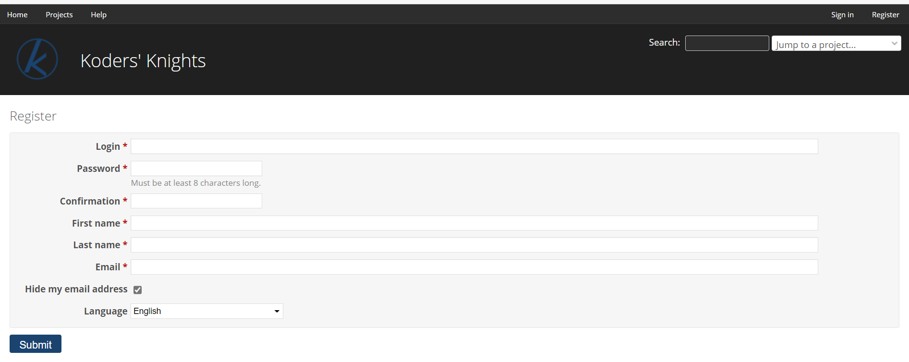

Once approved by one of the admins, you can login yourself with your login name and password. The Lost password link is only displayed if it has been activated by the admin.

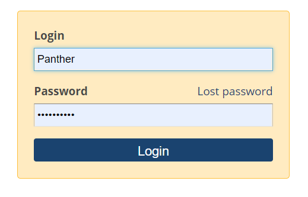

## **Features**

###  Issue Tracking
An issue is bound to a project, created/updated by the members of the project. 

#### **Generate issues**
Click on _New issue_ on top right corner to create a New Issue.

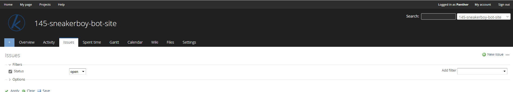

Create a issue by giving out all the issue details wherein you can set a deadline for the issue you create, assign it to one of the members from the team, give an estimated time, maintain a checklist for the same and many more. The most important here is the Tracker field that keeps a track of the nature of the issue.

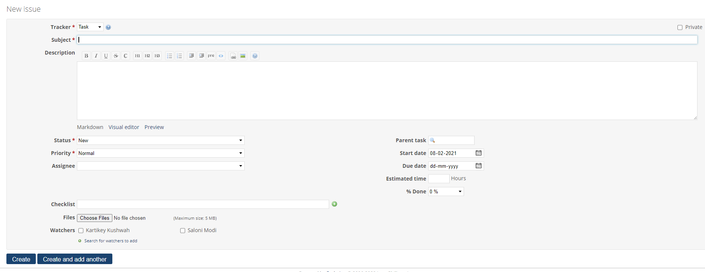

### Project Overview 

-   Issue Tracking - Overview of open and closed issues under each project  
-  Members - To keep track of all the members under the given project including developers, managers and project head.
- Spent Time - To log an new task, view details and report of the work.
- Add Bookmark - To add/remove bookmark.

 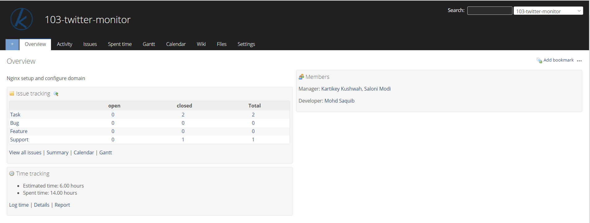

 ### Project Activity 
It gives a log of all the activities that had happened in the project.
 - 📁A new issue (feature, defect...) has been created.
 - 🖊The status of the issue has been changed.
 - ✅The given issue has been closed.
 - 📒A note to the issue has been added.
 - ⚙A changeset has been commited to the repository.
 - 📰A news has been added to the news area.
 - 📋A message in the forum area has been added.
 - A reply to a message in the forum has been added.
 - 📝A wiki page has been edited or newly created.
 - 📎A new file has been added in the files area or to a document.
 - 📄A new document has been added.
 - 🕑Some hours has been logged.

 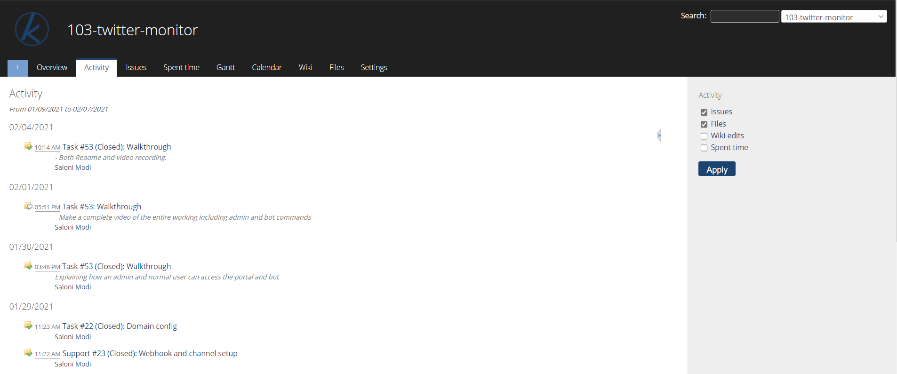

### Time Tracking :
It allows you to keep a track of the time you have spent on a particular issue or project. 

#### _Log your work :_
Click on Log Time on top right corner under 
**Spent Time**
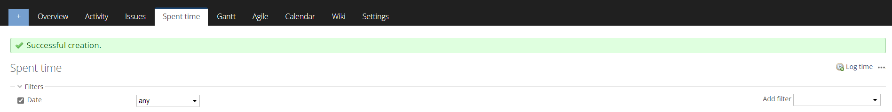

Fill in the required details of your log (Issue optional), add Comments to what you have done and add an Activity to the task.

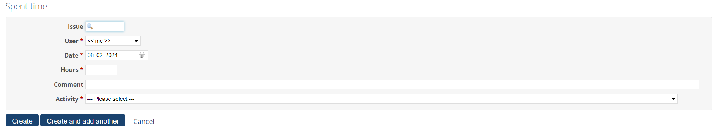

📜 Note: Try and log tasks less than 1.5 hours at a stretch. Divide your task into milestones and log it. 
#### **Accepted Time Formats**:
<li> As a fraction of hours in decimal time format using either period (.) or comma (,) as decimal separator: 1.5, 1,5 (equals to 1h30)
<li> Hour and minutes as an integer using standard time format: 1h, 1 h, 1 hour, 2 hours, 30m, 30min, 1h30, 1h30m, 1:30

#### **Details and Report**
- Get details on the spent time along with Date, Activity, Issue, Comment, Hours
- Get detailed report on the spent time by applying apt filters to it.

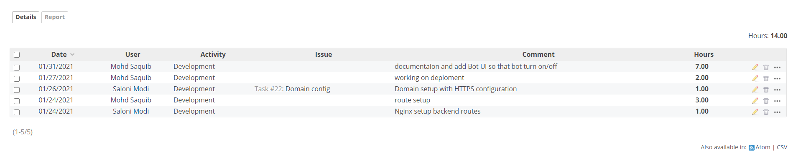

###  Calendar
The calendar gives you a monthly overview of the project.
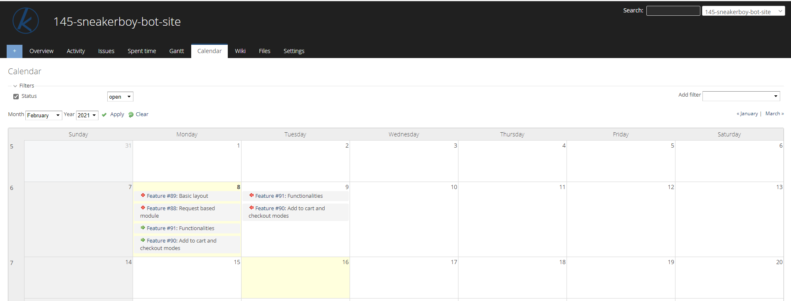

These are the options displayed on the calendar along with the issues.
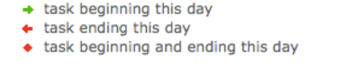

#### **Filters**
You can also define filters to view a subset of issues that can be shown on the calendar.

###  Agile Board

Enable your agile board by selecting the Agile checkbox under Settings for the project you are working on. Click on Save to save your changes. 

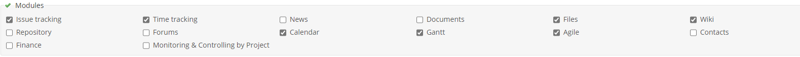

Now you can view the board by clicking on Agile in your Options bar next to Gantt. All your issue details will be listed here under the Status it currently is in. You can drag the issues from one column to the other to update its status.

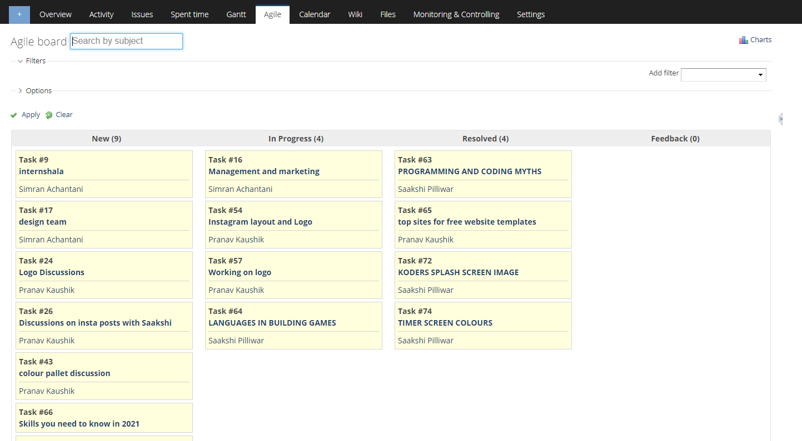

You can also view the Agile chart by clicking on Charts on the top-right corner and apply Filters as how you want to.

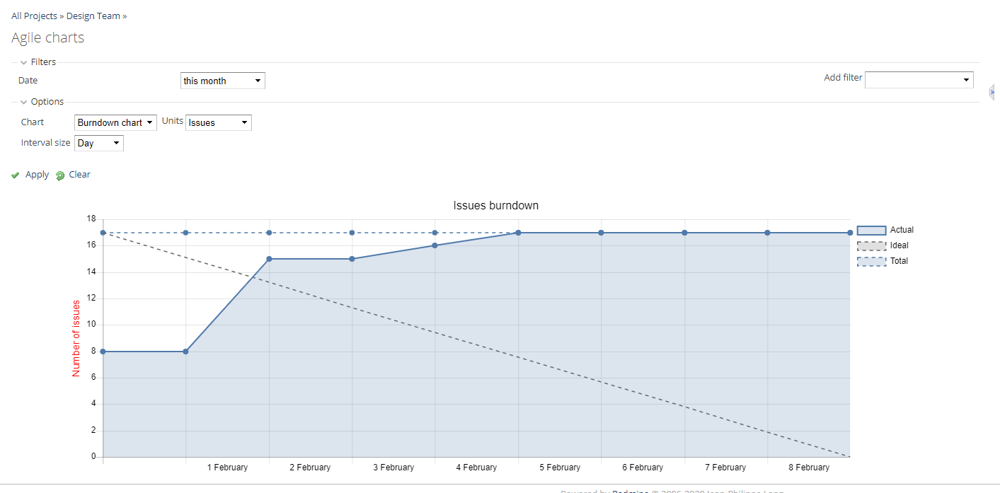

###  Forums
It allows users to communicate with each other regarding any details on the project. Click on Forums in the Options bar after it has checked under Settings. You can create a New Message by clicking on it on top right corner and start a new Konversation by giving all the details to it. 
Click on an already existing thread to view the details, edit reply or delete the message as required. 

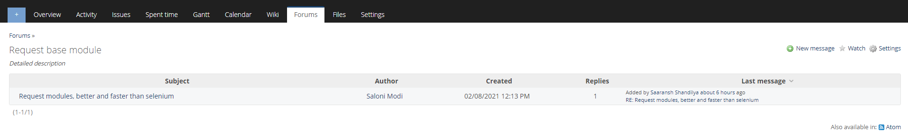

###  **Are you from Marketing team? Want to keep a track of your contacts?**

This is the right place for you. Create a New Contact by clicking on Contacts under your project.

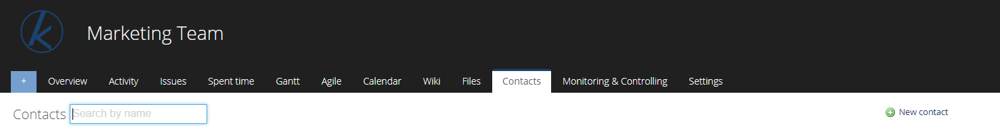

Fill in all the contact details and update the details of all the leads you have been tapping.

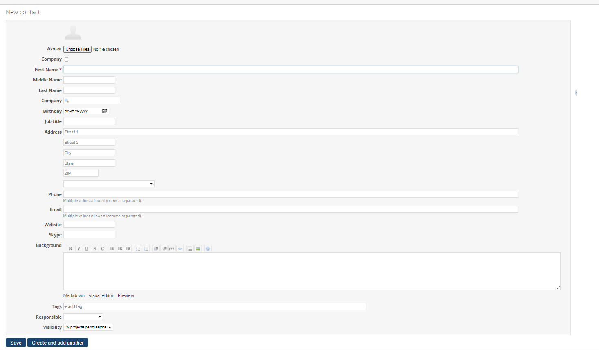

<li> Tags - can be used for adding extra information about contact e.g. Koders, interns, design, marketing, and all such.
<li> Responsible - the person responsible in the team for filling up the contact details
<li> Visibility - private, public or by projects permissions

###  Wikis
Keep information about a project organized in one place. 

#### **Create a new Wiki page**

Add a link to the page that you want to create. 

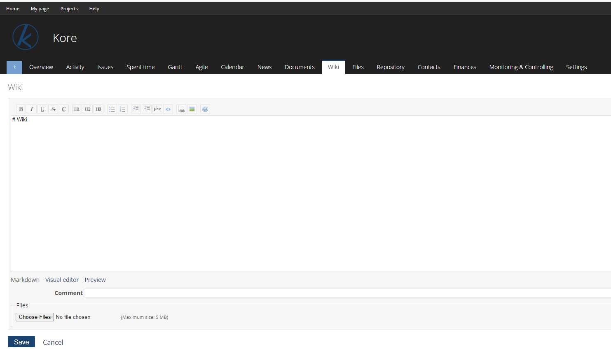

You can also add Comments to the added details, add Files if you want to and save the details. 

### **Monitoring & Controlling**

It gives an overview of all the activities under the selected project and is divided into 3 categories:

<li> Tasks Management - Gives a track of all the tasks, by statuses, by Category, graphs and charts under each of them.

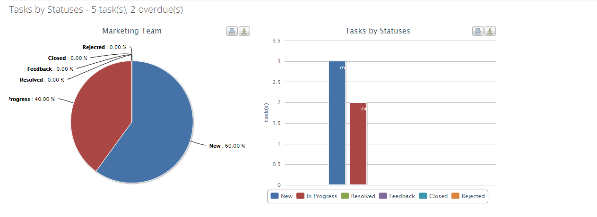

<li> Time Management - Gives a track of estimated and executed time, due and spent hours by the team.

<li> Human Resource Management - Gives a track of the issues by Assignee.

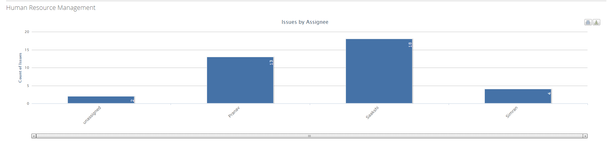

### Made with ❤️ by [Koders](http://koders.in/)

  

  <i> "Your vision, Our Kreation" </i>
   
   
  An institution that caters to all your software needs with their touch of Koding.
   
  <a href="https://www.koders.in"><strong>Explore More»</strong></a>
   
   
  <a href="https://www.github.com/koders-in">Github</a>
  ·
  <a href="https://www.linkedin.com/company/54359381/">LinkedIn</a>
  ·
  <a href="https://www.youtube.com/channel/UCZ5abFiwqKyJLIQ1Jqb6bNg">Youtube</a>
  ·
  <a href="https://www.instagram.com/koders_in/">Instagram</a>
  ·
  <a href="https://discord.gg/hGS24JC">Discord</a>

